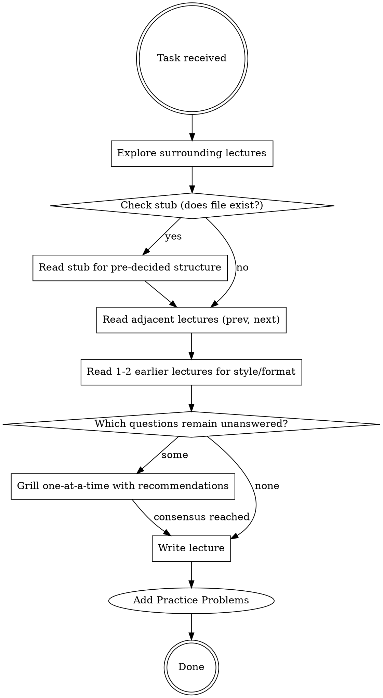

# Creating Course Lectures

## Overview

Explore the surrounding content first to answer as many design decisions as possible from the code, then grill on what's left. Writing starts only after full consensus.

## Workflow



## Explore Phase

From exploring surrounding lectures, answer without asking:
- **Format and MDX components** — what callout types, code block titles, table styles are used
- **Prose voice** — terse and direct vs. discursive; Python comparison cadence
- **Exercise count and structure** — how many, predict-the-output vs. write-a-function, starter/solution CodeGroup pattern
- **Prior coverage** — what concepts are already established so this lecture can build on them without re-explaining
- **Forward references** — callouts that promise "we'll cover this later" that this lecture may need to fulfill

## Grill Phase

Grill only on decisions the codebase cannot answer. Resolve in dependency order — structural decisions before detail decisions. For each question:
- Provide your own recommendation
- Ask one at a time, wait for answer before continuing

Typical decision tree for a new lecture:

1. **Assumed knowledge** — what from prior lectures can be taken for granted vs. briefly re-introduced?
2. **Topic scope** — which subtopics to include; which to defer to a later lecture?
3. **Depth per topic** — brief intro vs. full treatment?
4. **Structural choices** — inline guidance woven in vs. summary section at end?
5. **Exercise types and count** — predict-the-output, will-this-compile, write-a-function, debug-this?

## Write Phase

Follow the patterns established by adjacent lectures exactly:
- Match heading hierarchy and section naming conventions
- Use the same MDX component set (Callout variants, CodeGroup, etc.)
- Keep exercise difficulty progression consistent with surrounding lectures
- Sort exercises: mechanical/trace first, open-ended/write last

## Practice Problems Phase

After writing the lecture body and exercises, append a `## Practice Problems` section at the very end with 2–4 relevant LeetCode problems.

**Format:**
```markdown
## Practice Problems

- [Problem Title](https://leetcode.com/problems/problem-slug/) — Easy
- [Problem Title](https://leetcode.com/problems/problem-slug/) — Medium
- [Problem Title](https://leetcode.com/problems/problem-slug/) — Hard
```

**Selection rules:**
- Match problems to the lecture's primary data structure or concept — not the language syntax
- Sort by difficulty: Easy first, Hard last
- Prefer problems where the lecture's implementation maps directly to the solution approach (e.g., stack lecture → Valid Parentheses)
- For OOP / language-mechanics lectures (copy semantics, move semantics, operator overloading), prefer LeetCode "Design" problems that exercise the same resource-management patterns
- Skip the Practice Problems section only for non-coding lectures (syllabus, dev setup, diagnostic exams)

### CodeGroup language consistency

All tabs within a single `CodeGroup` must use the **same language identifier**. Never mix `cpp` with `text` or any other language in the same group. For exercises where the solution is plain output (not compilable code), use `cpp` for the solution tab and format it as a comment block or annotated output inside a `main`-like stub — whatever keeps the language consistent. If the solution is truly just printed output, use `text` for **both** tabs (starter and solution), not just one.
